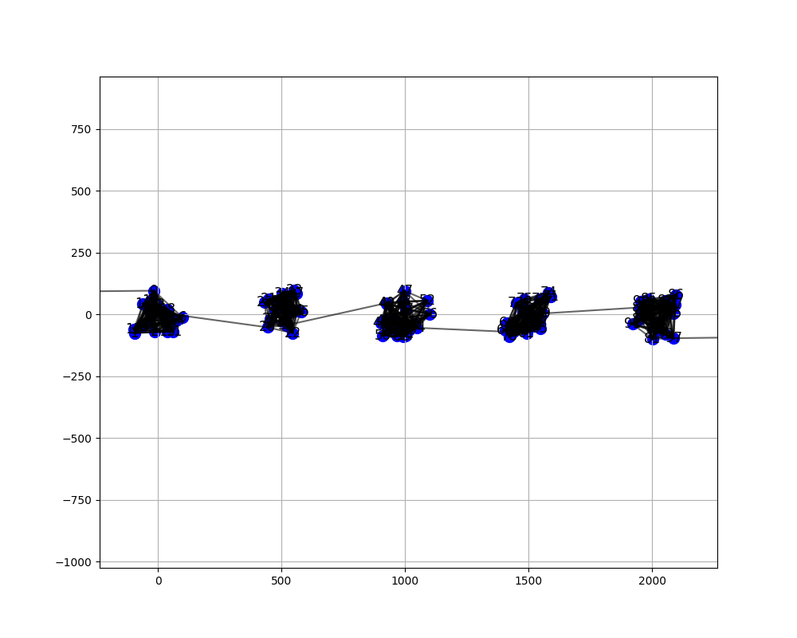

# Testni programi za ALG DN 2
Nekaj programov, za iskanje najkrajše poti med 2 vozlišči v grafu. Dve datoteke so namenjene kreiranju grafov, ena z genetskim algoritmom, ena pa po šabloni, kjer so uporabljeni polni grafi Kn.
## a_star.py
Implementacija A* algoritma za iskanje najkraše poti med 2 vozliščema v grafu. Za zagon nad grafom:
```
python a_star.py <pot_do_grafa>
```
## dijkstra.py
Implementacija dijkstra algoritma za iskanje najkraše poti med 2 vozliščema v grafu. Za zagon nad grafom:
```
python dijkstra.py <pot_do_grafa>
```

## bfs.py
Poskus za algoritem po principu "breadth first search", ki ne deluje vedno pravilno (pot najdena s tem algoritmom se razlikuje od poti ostalih 3 algoritmov). Za zagon nad grafom:
```
python bfs.py <pot_do_grafa>
```

## generate_graph.py
Na podlagi parametrov total_number_of_nodes in number_of_subgraphs zgradi testni graf. Ta je zgrajen iz vozlišč s, m, t in <number_of_subgraphs> dolgo potjo med vozliščem s in m, ki je zgrajena iz polno povezanih grafov iz <total_number_of_nodes> //<number_of_subgraphs> vozlišč. Primer takšne poti je na sliki [grafa](example_graph). Vozlišče s je "daleč" stran od poti v smeri x osi, vozlišče m pa ločuje t od poti na desni strani. Tudi m in t so "daleč" stran od poti.

<a name="example_graph"></a>


## generate_graph_with_genetic_algorithm.py
Poišče "najboljši" graf glede na število obiskanih vozlišč pri iskanju najkrajše poti med 2 vozlišči. Generirani grafi v populaciji imajo vsi enaka vozlišča s in t in njihova vozlišča so vzeta iz [-1000,1000]*[-1000,1000].